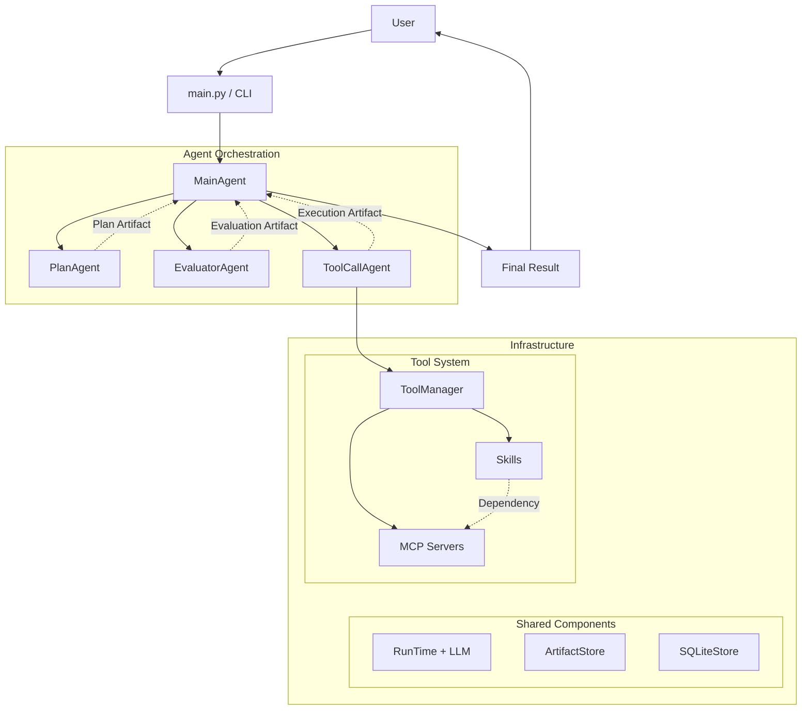

<div align="center">  </div>

## Overview



## Configure settings.json
- mcpServers
    - mcp server name
        - command: string
        - args: list
        - envs(optional): dict
- skills
    - skill name
        - skill root path: string
        - The MCPServers required for skill(optional): list, the required MCPServers must be configured in the `mcpServers`.
- model: Model manufacturers and versions
- runtime_max_loops: Max of loops for a single node activation.
- sqlite_path: Persistent storage location

```
Note: The token content should not be written in plaintext, otherwise it will be exposed. Write it in the format `${ENV_NAME}` , where `ENV_NAME` is the actual local environment variable name.
```

## Run
`python ~/main.py`


## TODO:
1. 工具整理(是否有些skill可以合并为一个完整的任务, 执行步骤的标题调整为###)
2. finish node 的时候是不是塞入整个message更好
3. 由于在runtime和agent流程中发生错误会直接raise，因此对于子Agent在数据库中的node_status为空，我们不需要记录status, 当raise之后依据run_id将所有为空的status设置成0即可
4. pydantic 和 dataclasses
5. 任务异常之后的数据还原，例如已经存储到数据库，但后续任务失败
6. Agent并行
7. 过程输出，转为HTML(界面问题)
8. structure是不是需要分类，依据result observation等？
9. assets有问题，暂时已pass, 当前assets在外部：assets=None tool_call=[Tool(target='获取恒生科技指数对应的唯一代码', name='skill.lixinger', args={'stockname': '恒生科技指数'}), Tool(target='获取当前日期以计算昨天日期', name='skill.norm', args={'data': '当前日期'})]
10. 项目结构整理
11. 当前ToolCall拥有所有工具权限，后面考虑是否拆出来让不同Agent具备不同权限，例如DataBase的Agent只有数据库工具的权限，等等
12. Jev/laya
13. 任务结束之后Plan是否可以移出message
