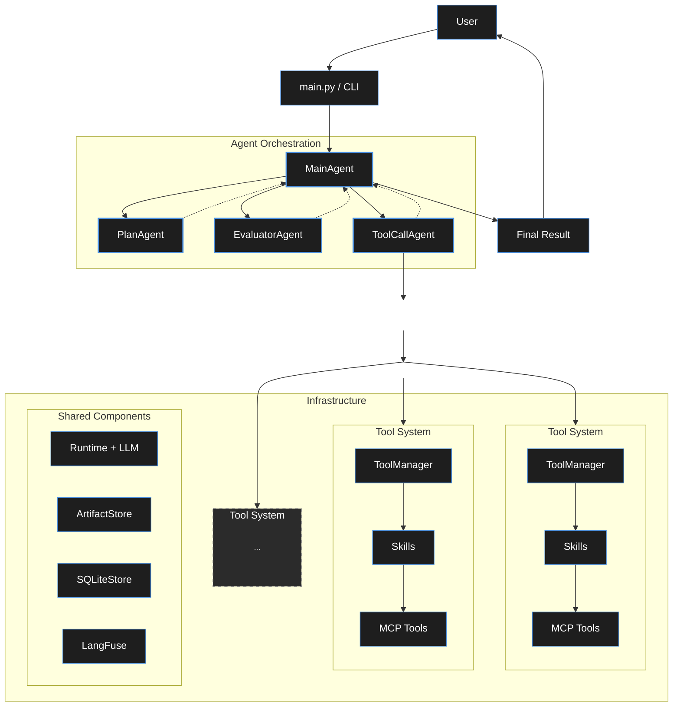

<div align="center">  </div>


## Configure settings.json
- mcpServers
    - mcp server name
        - command: string
        - args: list
        - envs(optional): dict
- skills
    - skill name
        - skill root path: string
        - The MCPServers required for skill(optional): list, the required MCPServers must be configured in the `mcpServers`.
- model: Model manufacturers and versions
- runtime_max_loops: Max of loops for a single node activation.
- sqlite_path: Persistent storage location

```
Note: The token content should not be written in plaintext, otherwise it will be exposed. Write it in the format `${ENV_NAME}` , where `ENV_NAME` is the actual local environment variable name.
```

## Run
`python ~/main.py`

## System Architecture

